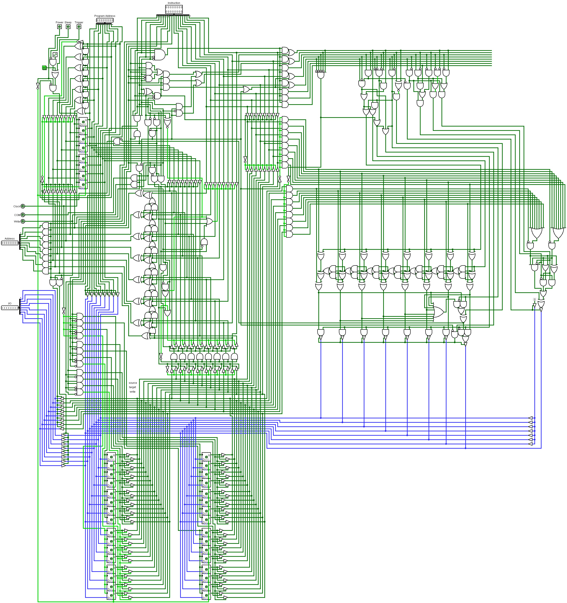

# logisim-8bit-cpu

An 8-bit cpu in logism using only basic logic gates and wire. Uses a custom CISC instruction set with 4 registers. The cpu is capable of basic arithmetic and logic, as well as both relative and absolute instruction jumping, with jumping by register fully supported for both.

Op.txt gives a brief overview of the instruction set.

Insertion_sort.txt contains hand compiled psuedo-code for the insertion sort algorithm.

